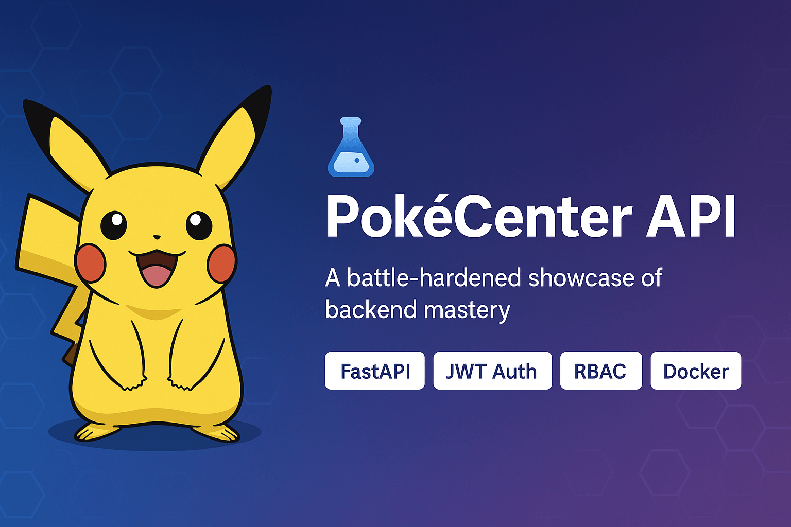

<p align="center">
  
</p>

<p align="center">

  <!-- 🧪 Test status -->
  <a href="https://github.com/Vikey-14/pokemon-api/actions/workflows/test_and_cover.yml">
    
  </a>

  <!-- 🐳 Docker build status -->
  <a href="https://github.com/Vikey-14/pokemon-api/actions/workflows/docker-build.yml">
    
  </a>

  <!-- 🌐 Live Site (DuckDNS Deployment) -->
  <a href="https://pokevcenter.duckdns.org">
    
  </a>

  <!-- 🐍 Python + FastAPI + License + Coverage -->
  
  
  
  <a href="https://coveralls.io/github/Vikey-14/pokemon-api?branch=main">
    
  </a>
</p>

# 🧪 PokéCenter API — FastAPI Project

Welcome to the **PokéCenter API**, a fully-featured FastAPI application crafted with clean modular architecture, secure JWT authentication, dynamic rate limiting, RBAC, file upload support, and full production deployment via Docker + NGINX + HTTPS.

This project is not just a backend—it's a **battle-hardened showcase of backend mastery**.

---

## 🚀 Features

- 🔐 **JWT Authentication**  
  - Login with secure access + refresh tokens  
  - Expiring access tokens (configurable)  
  - Refresh token rotation using UUID + in-memory store

- 🧪 **Role-Based Access Control (RBAC)**  
  - Protect sensitive routes via role check (`trainer`, `admin`)  
  - Easy role restrictions using `Depends(role_required(...))`

- 🧢 **Advanced Rate Limiting**  
  - All endpoints are rate-limited (e.g., `5/minute`, `10/minute`)  
  - Built using `slowapi` limiter with route-level decorators  
  - **Auto-bypassed in `TESTING=1` mode** for clean test runs  
  - Protects login, upload, and admin routes from **brute-force attacks**

- 🧼 **Modular & Scalable Architecture**  
  - All logic split across routers, utils, dependencies  
  - Follows clean separation of concerns and testability best practices

- 📁 **Secure File Handling**  
  - CSV import/export  
  - Image upload (single & multi)  
  - File preview, download, auto-saving with timestamped naming

- 🧠 **Full Test Suite with Pytest**  
  - Every route tested (CRUD, uploads, auth, analytics)  
  - Environment-isolated via `.env.test`  
  - Rate limiter bypass, mock tokens, and reset fixtures built-in  
  - 🧪 *Overcame real nightmare bugs to reach full test stability*

- 🐳 **Docker-Ready**  
  - `Dockerfile` and `docker-compose.yml` ready for prod builds  
  - Uvicorn app served via NGINX  
  - Supports `.env` based environment switching

- 🛡️ **Production Security**  
  - Secure HTTP headers using middleware  
  - Auto HTTPS redirect when `FORCE_HTTPS=True`  
  - NGINX reverse proxy with optional SSL (Let's Encrypt supported)

- 🪄 **Swagger UI**  
  - Fully interactive docs at `/docs`  
  - Tags, route descriptions, sample payloads

---

## 🛠️ Project Setup

### 📦 Install Requirements

```bash
pip install -r requirements.txt
```  


### 🗂️ Project Structure

📦 fastapi_project/
├── auth/
│   └── hybrid_auth.py               # Login, JWT creation, role-based access
├── routers/
│   ├── pokemon.py                   # CRUD routes for Pokémon
│   ├── team.py                      # Team building routes
│   └── upload/
│       ├── upload_csv.py            # CSV upload routes
│       ├── upload_image.py          # Image upload routes
│       ├── upload_misc.py           # Save + preview files
│       ├── download.py              # Download logs, images, CSVs
│       └── __init__.py
├── tests/
│   ├── pokemon/
│   ├── team/
│   └── upload/
│       ├── test_upload_csv.py
│       ├── test_upload_image.py
│       ├── test_upload_misc.py
│       └── test_download.py
├── utils/
│   ├── file_utils.py                # File saving helpers
│   ├── limiter.py                   # limit_safe wrapper
│   └── team_handler.py              # Save/load team data
├── dependencies/
│   └── pokedex_provider.py          # Shared Pokedex loader
├── core_app.py                      # Main FastAPI app instance
├── main.py                          # Entry point for dev
├── Dockerfile
├── docker-compose.yml
├── .env                             # Actual environment vars (excluded from git)
├── .env.example                     # Sample env file for others
├── README.md
└── requirements.txt
